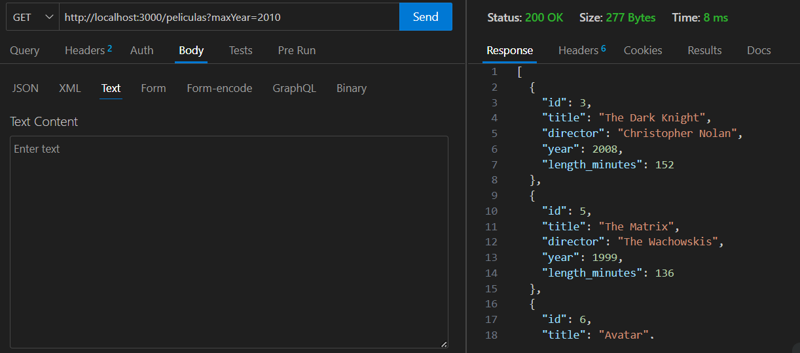

#Datos del .env
DATABASE_HOST=localhost
DATABASE_PORT=3306
DATABASE_USER=victor
DATABASE_PASSWORD=victor
DATABASE_NAME=peliculas_pokemon_db

# Imágenes de las comprobaciones para verificar que todo funciona

 

# Por último tras probar los DELETE, vemos que ya no hay nada

# Probamos los filtros

